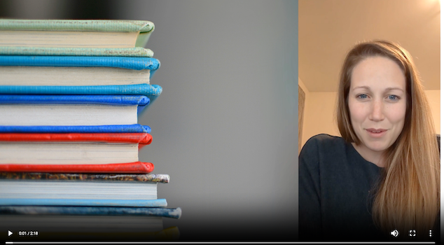

# Welcome 

Welcome to the [Future of Education](https://melbconnect.com.au/events/the-future-of-education) Resource Hub!

Thank you very much for participating in the Future of Education event! This space has been designed to help you reflect on the rich discussions and insights shared during the event. Our aim is to provide a suite of educational resources that cater to different learning preferences, fostering deeper understanding and engagement with the topics explored.

---

## Goals

This resource hub is intended to:
- Enhance your learning and reflection on the event's discussions.
- Provide timely resources in various formats that suit diverse learning preferences.
- Serve as a collaborative space where educational insights can continue to grow.

---

## Introductory Video for You



[Access it here](resources/digitaltwin.mp4)

---

## What is this About? AI Resources Showcase from the Future of Education Melbourne Connect Event

During the Future of Education event at Melbourne Connect (Nov 13, 5pm-7.30pm), we developed this Jupyter Notebook to demonstrate practical applications of AI tools in promoting education. This specific project demonstrations was structured into two key parts:

**Part 1:** We gathered real-time data from participants, sparking discussion and reflection on three pivotal questions:
1. Does AI stifle creativity, or enhance it?
2. Does AI prevent critical thinking, or foster it?
3. Does AI remove barriers between vocational and higher education, or increase them?

To support our analysis, we collected transcripts from select group discussions.

In 25 minutes, we applied various AI tools to transform these insights into multiple resources, including thematic visualisations, podcasts, and interactive games. 

**Part 2:** These resources, which highlighted the responsiveness, inclusiveness, and adaptability of AI in educational contexts, were made accessible and presented to all participants for further exploration (during the event). We collected data in Part 1, took 25mins to produce these resources while the event was happening, and returned at the end of the event to showcase this resource hub to participants.


**Disclaimer:** _Please note that, due to the rapid pace of content generation during this activity, we did not have the opportunity to fully validate the accuracy of all outputs. The primary goal of this session was to showcase the potential applications of AI in educational settings, rather than to create rigorously verified learning content. We encourage participants to view these outputs as exploratory demonstrations of AI’s capabilities_.

---
## Summary of Discussion Analysis from Audience (Claude)

[](resources/discussions2.png)

```
Common Threads across all documents:
Recognition of AI as a supportive tool rather than a replacement for human thinking
Emphasis on maintaining balance in AI usage
Agreement on the need for educational evolution to accommodate new technologies

Main Differences:

Approach to Implementation:
Document 1 is more optimistic, focusing on integration and future possibilities
Document 2 emphasizes caution and restriction, particularly regarding youth access
Document 3 takes a middle ground, focusing on guided usage and teacher adaptation


Primary Concerns:
Document 1: Academic integrity and proper tool utilization
Document 2: Media literacy and information overload
Document 3: Balance between AI assistance and personal development


Solutions Proposed:
Document 1 suggests integrated platforms and collaborative spaces
Document 2 advocates for restrictions and media literacy programs
Document 3 recommends balanced approaches and teacher training
```

[Interactive Version of the Summary of Discussion Analysis from Audience is Available Here](https://claude.site/artifacts/99a9d0d5-2c50-4c0a-818a-488986bd321b)

## About Us

This initiative is brought to you by a team committed to making education accessible and engaging for everyone:

- [Eduardo Oliveira](https://findanexpert.unimelb.edu.au/profile/653031-eduardo-araujo-oliveira)
- [Kayley Lyons](https://findanexpert.unimelb.edu.au/profile/918571-kayley-lyons) 
- [Shatana Dushyanthen](https://findanexpert.unimelb.edu.au/profile/642166-sathana-dushyanthen) 
- [Cory dal Ponte](https://medicine.unimelb.edu.au/school-structure/medical-education/research/graduate-research-students/cory-dal-ponte)

We hope these resources support your continued learning journey and inspire new ways of thinking about the future of education. Thank you for being a part of this transformative event!