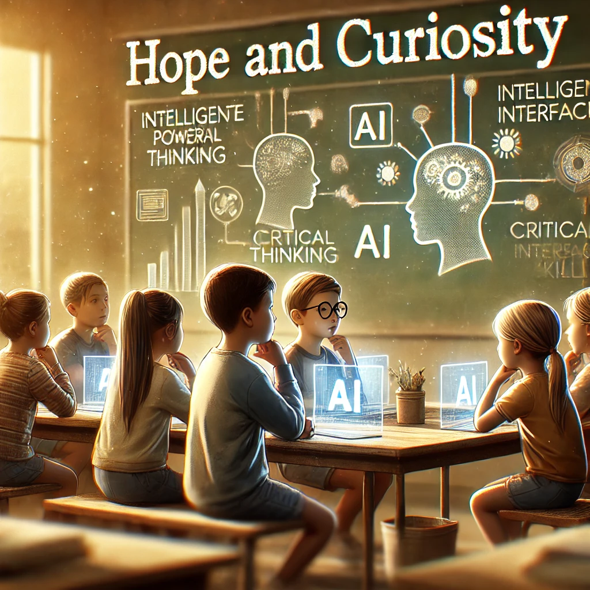
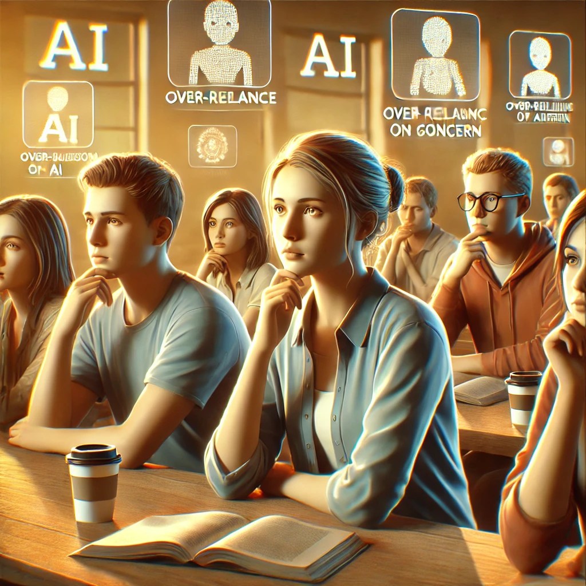
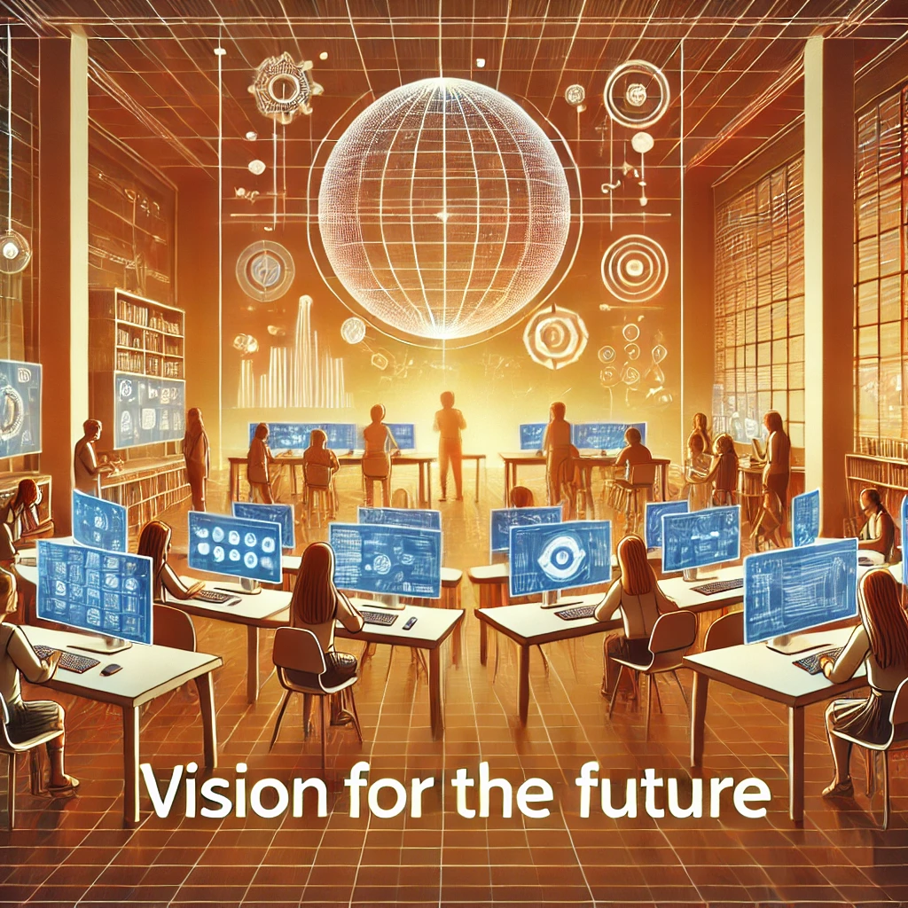
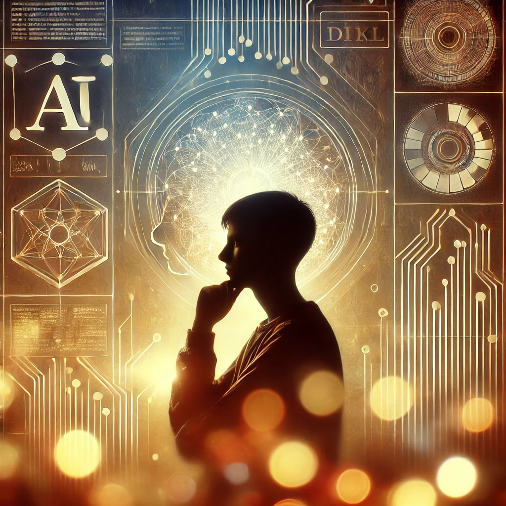

# Images

## Tool Used
We created this resource using [DALL-E](https://openai.com/dall-e/). This tool was chosen for its ability to generate high-quality, concept-driven images based on detailed prompts, enabling a visually nuanced representation of complex discussions.

## Generation Prompt
The prompt we used to create this resource was:

```
Considering the attached PDFs, create a series of independent images that reflect the diverse emotions and viewpoints expressed
in discussions about how technology influences students' critical and creative thinking. 
The images should visually capture contrasting themes from discussions.

Use a warm and thoughtful colour palette to emphasise a reflective, nuanced atmosphere, where each image conveys the complexity
of opinions around technology in education. Explain the links between generated images and parts of discussions captured 
within the transcripts.

```

This prompt was designed to ensure comprehensive coverage of the range of emotions and insights expressed by participants, encouraging creative and interpretive visuals that reflect the multifaceted nature of technology’s impact on students' critical thinking.

## The Resource (Output)

> Note:
> The following section is the direct output generated from the applied prompt. It reflects a structured summary of the transcribed conversations.

---

Identified themes from transcripts:
- **Hope and Curiosity**: Show how technology can empower students to think critically, represented by scenes of young people using digital tools thoughtfully, engaged in discussions with AI or interactive interfaces that encourage questioning and curiosity.
- **Scepticism and Concern**: Illustrate the challenges and potential harms, with scenes showing individuals expressing caution or concern about the over-reliance on AI or technology, which may dull critical thinking. Include subtle cues like faces in contemplation, or people looking at screens with mixed expressions.
- **Vision for the Future**: Display the optimism around fostering a balanced future where technology supports critical and creative thinking. Visualize a classroom or collaborative space with a harmonious blend of digital and human elements, where students are engaged in both tech-based and interpersonal interactions.
- **Thoughtful Reflection**: Capture moments of introspection, symbolizing the participants’ mixed feelings about technology’s dual role. Consider imagery like silhouettes against screens, hands-on-chins, or students examining AI-generated information critically.

### Hope and Curiosity:



Image Description: This image portrays young students using digital tools in a classroom, interacting thoughtfully with AI on their screens. Their expressions reflect curiosity and engagement, symbolising the potential of technology to encourage questioning and exploration.

Transcript Link: This reflects the conversation on the potential of AI to facilitate a more engaging learning environment. Participants discuss how technology, when used correctly, can enhance students' analytical abilities by encouraging them to question and challenge information.

### Scepticism and Concern:



Image Description: This scene shows students with contemplative expressions, some viewing screens with a hint of doubt. Their body language conveys caution and a sense of questioning, representing concerns about over-reliance on AI.

Transcript Link: The discussion highlights concerns about students potentially accepting AI-generated answers without scrutiny. The conversation suggests that, just as with biased educators, students should be trained to maintain a critical stance toward AI-generated content, reflecting this image’s cautionary tone.

### Vision for the Future:



Image Description: In this modern classroom, students interact collaboratively around screens, blending digital engagement with in-person discussions. The harmonious setup symbolises an optimistic, balanced vision where technology and human interaction coexist to foster critical thinking.

Transcript Link: The participants discuss the future of AI in education, emphasising the importance of embedding questioning skills within AI interactions. This vision of a balanced future aligns with the conversation about creating environments that encourage students to use technology actively and thoughtfully.

### Thoughtful Reflection:



Image Description: This introspective scene shows a student silhouetted against a glowing screen, deep in thought. With a hand on their chin, the student carefully examines the information before them, symbolising mixed emotions about the influence of AI on critical thinking.

Transcript Link: Reflecting on the dual nature of AI, participants express that AI could both support and limit critical thinking. This moment of thoughtful reflection illustrates the complexity and responsibility of engaging with AI, resonating with the nuanced perspectives shared in the discussion.


---

## Reflection on Educational Use
This visual resource serves as a unique educational tool, offering both educators and students a visually engaging way to explore and interpret the role of technology in shaping critical and creative thinking skills. For educators, these images can be a starting point for reflective discussions, inspiring conversations about the impact of digital tools on cognitive development and guiding students in understanding the complexity of their digital interactions.

For students, the resource offers an opportunity to deepen their awareness of how technology influences their thought processes. These images, depicting a range of emotions and perspectives, can help students reflect on their own experiences, fostering a critical mindset when approaching technology. Visual representations of themes like scepticism, curiosity, and future-oriented thinking allow students to relate to the topic on a personal level and actively engage with questions around digital literacy.

Ultimately, we believe that resources like this bring a powerful visual dimension to learning, supporting a more interactive and thought-provoking approach to technology in education. By integrating artistic elements with educational content, such resources can foster a more holistic and empathetic understanding, bridging abstract concepts and real-world applications in the classroom and beyond.

