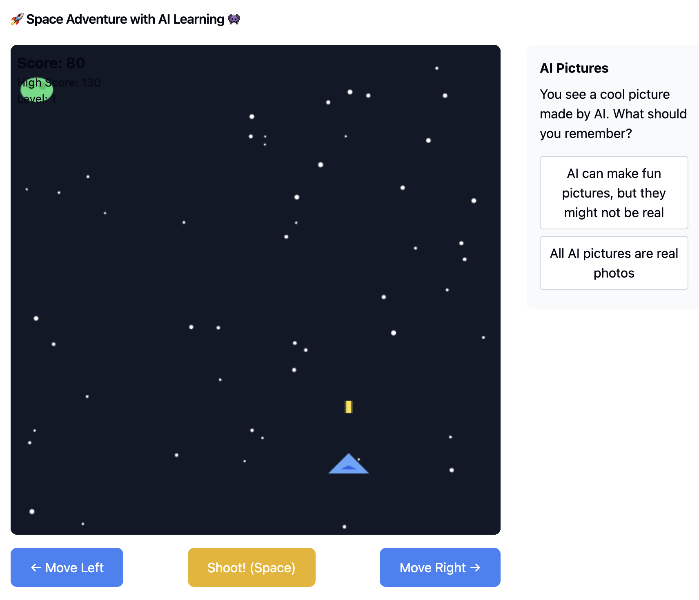

# Game - Responsible AI for Kids

## Tool Used
We created this interactive game to teach kids on how to use AI responsibly resource using [Claude](https://www.anthropic.com/index/claude). 

## Generation Prompt
The prompt we used to create this resource was:

```
UPDATE THIS
```


### The Resource (Output from Claude)



You can access the Tetris game we created for you [here](https://claude.site/artifacts/b648b005-5294-452d-b0b7-6a45c62a5108)

## Reflection on Educational Use
Resources like this can play a transformative role in education by shifting traditional, passive learning methods towards interactive, student-centered experiences. By embedding critical thinking skills directly into the gameplay, the game not only fosters engagement but also equips students with strategies for responsible technology use, preparing them for a future where they can navigate the digital landscape thoughtfully and effectively.

