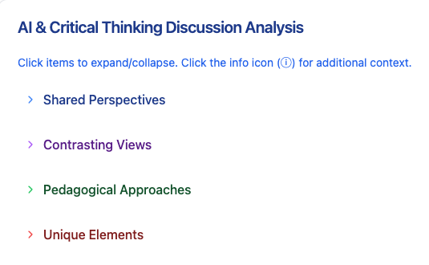

# Theme Analysis

## Tool Used
We created this theme analysis resource using [Claude](https://www.anthropic.com/index/claude). This tool was chosen for its advanced analytical capabilities and its ability to create structured and interactive resources based on complex conversation data, making it ideal for exploring critical themes in educational discussions.

## Generation Prompt
The prompt we used to create this resource was:

```
Would you be able to create an interactive theme analysis from the transcripts attached here? These documents are from conversations on "How can technology be helpful or harmful to students' critical thinking skills? In what ways can we create a future that better fosters critical and creative thinking?"
```


This prompt was designed to capture key themes from the conversation, providing a balanced view that highlights both the benefits and risks of technology in education while offering insights for fostering critical thinking.

## The Resource (Output from Claude)

> Note:
> The following section is the direct output generated from the applied prompt.

---



You can access the theme analysis we created for you [here](https://claude.site/artifacts/6f3348ce-9637-4d55-b991-474e358f0720)

---


## Reflection on Educational Use
This theme analysis serves as a valuable resource for both educators and students, providing an in-depth look at how AI can impact critical thinking in educational contexts. For **educators**, this document offers a framework for addressing the benefits and challenges of AI, with an emphasis on fostering questioning, skepticism, and independent thinking. Teachers can integrate these themes into lesson plans, encouraging students to engage critically with AI-generated information and develop a balanced perspective on digital tools.

For **students**, this analysis highlights key principles for interacting with AI responsibly and thoughtfully. By understanding the importance of questioning and skepticism, students are better prepared to navigate a world increasingly influenced by AI, making independent, informed decisions about the information they encounter.

We believe that resources like this can transform education by promoting a reflective approach to technology use, fostering a learning environment where AI is used to complement, not replace, traditional critical thinking methods. By encouraging both educators and students to approach AI with intention and discernment, this resource supports a balanced, thoughtful integration of technology in education.
